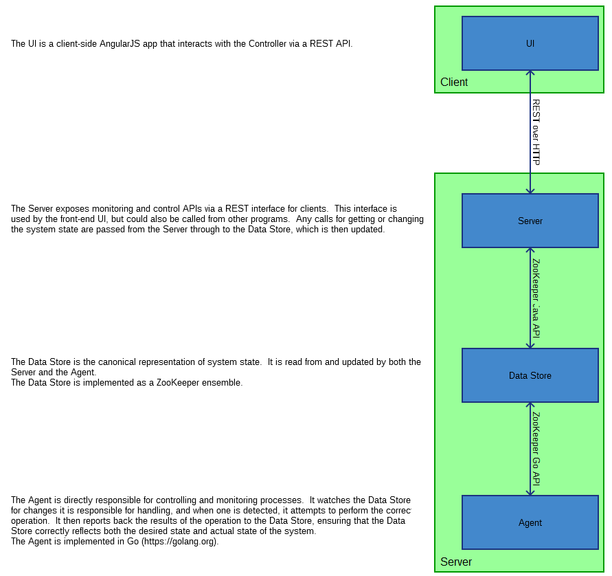
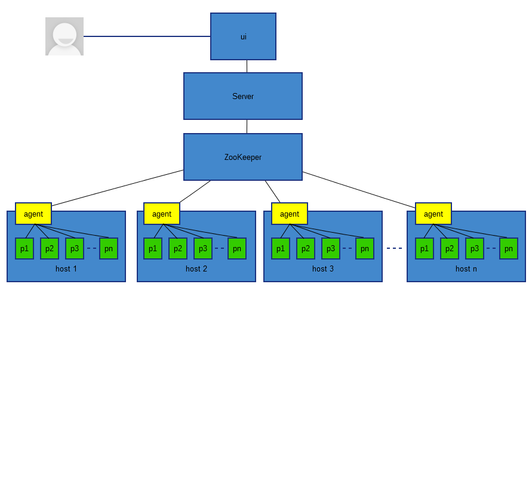
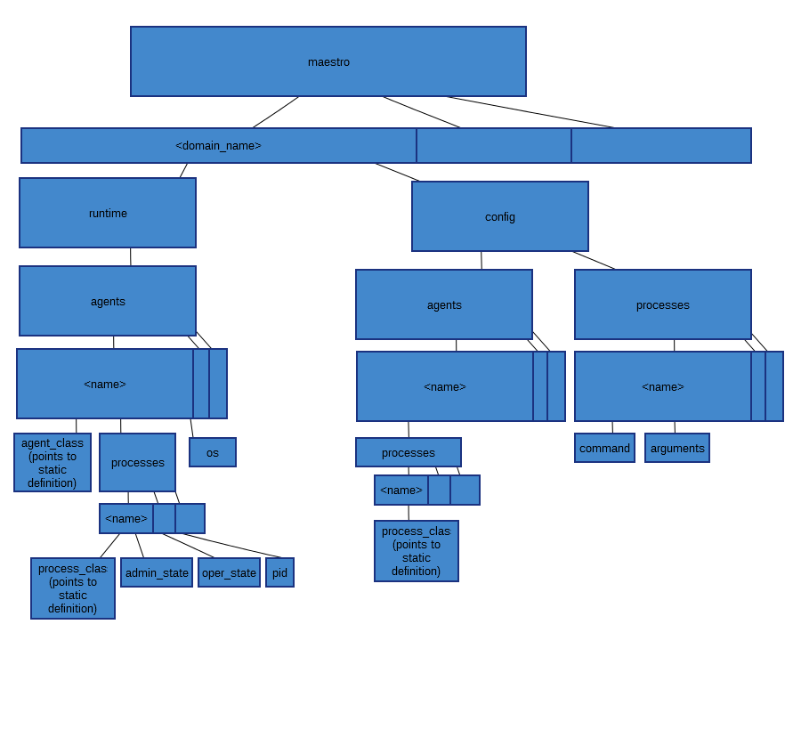
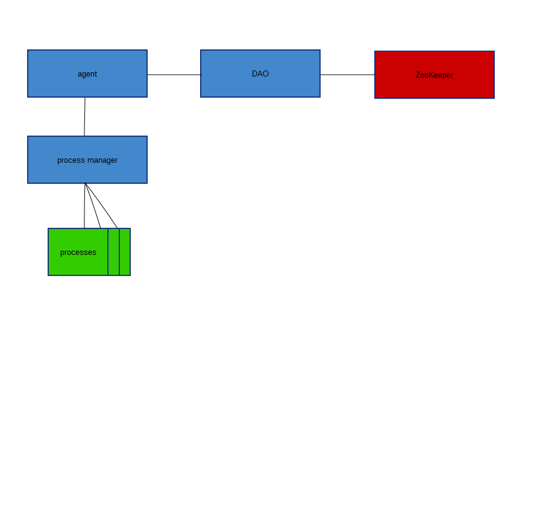

maestro architecture
====================

system architecture
-------------------
The following image shows the system structure of maestro. It contains details about each of the components.

This image shows the host view of the system, including the agents and processes running on the hosts:

zookeeper data structure
------------------------
The following image shows the design of the ZooKeeper data tree.

Under the `maestro` node are all of the domains. Under each domain there is a `config` node which contains static configuration and a `runtime` node which contains information about the currently running system.

agent design
------------
The following image shows the design of the maestro agent:

The agent watches both the ZooKeeper database and the running processes that have been started. It watches ZK waiting for commands to turn processes on or off. It watches the processes to ensure that they continue running.